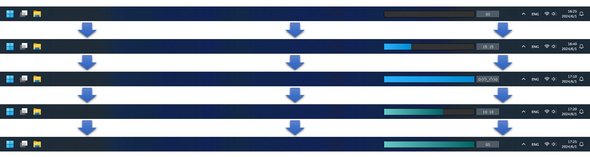

# TomatoTimer
A small plugin that displays work and relax progress in the taskbar for Windows.



## Requirement
- PyQt5
- win32gui

## Useage

The file name should be NAME_WW-RR_XX-YY.py.  

It will make the working time of the program WW minutes and the relax time RR minutes.

The plugin windows will appear in the coordinate (XX,YY) in the screen.

(You can use the pyinstaller to export it to one file named NAME_WW-RR_XX-YY.exe)

### Run:
```bash
python TomatoTimer_45-15_1240-1035.py 
```
### Export to exe file: 
```bash
pip install pyinstaller
pyinstaller -F -w -i TomatoTimer.ico --name TomatoTimer_45-15_1240-1035.exe TomatoTimer_45-15_1240-1035.py
```

### For UI: 
Click the "GO" button to work, the progress time is WW min.
After the timing ends, the button will change to "Emoji".
Click the "Emoji" button to relax, the progress time is RR min.
After the timing ends, the button will change to "GO".
(If you press the Ctrl key and then click the button, it will skip the next stage and proceed directly to the next next stage, which means you can continue working and relaxing)

### Auto startup: 
Create a shortcut file and place it in folder “C:\Users\Username\AppData\Roaming\Microsoft\Windows\Start Menu\Programs\Startup”

### Exit program: 
Press the Alt key and then click the button or  end process in Task Manager (Ctrl + Alt + . ).

## Contact
If you have any questions, feel free to contact me via: `frazer.linzheng(at)gmail.com`.  

